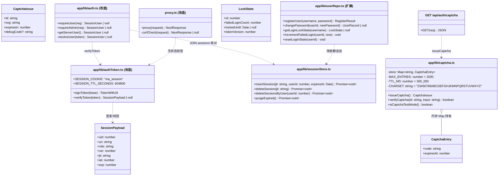
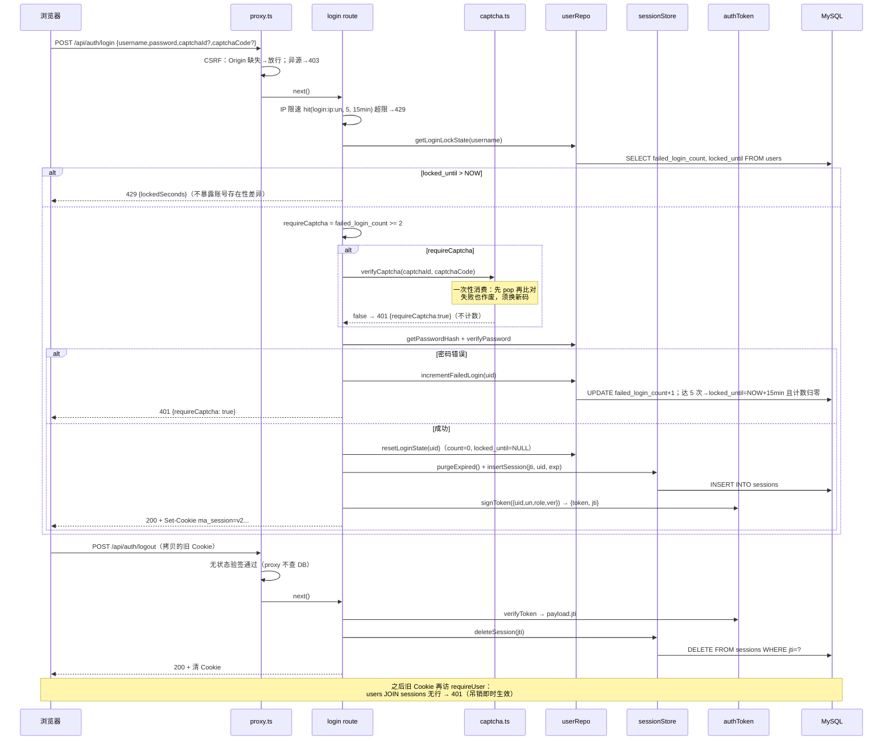
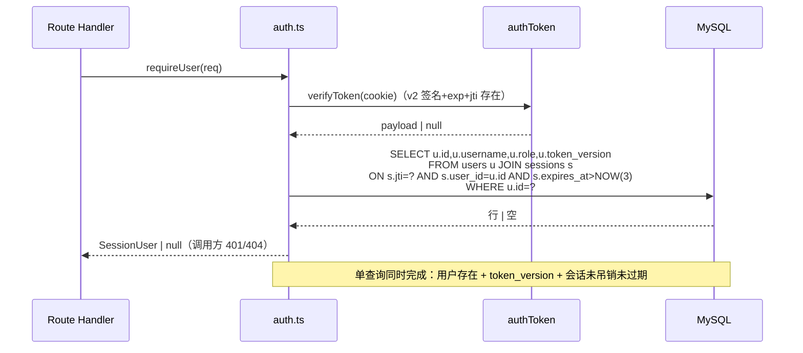
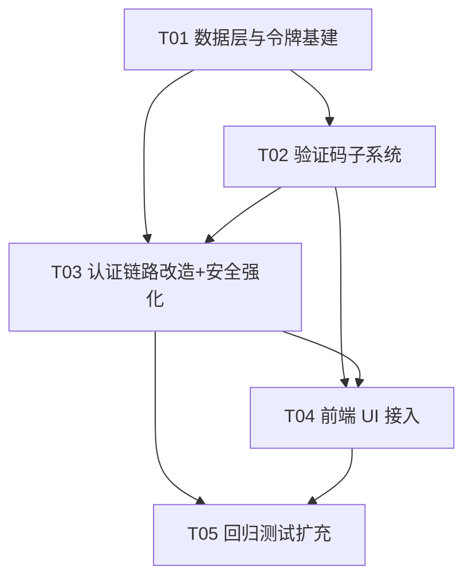

# 增量架构设计：验证码 + 安全强化包（迭代 v3）

> 撰写：架构师 高见远（Bob/Gao）｜状态：待齐活林落盘转工程师
> 输入：`docs/prd-验证码与安全强化-2026-09-30.md`（R1-R13）+ 老总拍板三项 + 现有代码实况
> 原则：零新依赖、改动面最小、48 用例回归不破坏

---

## Part A：系统设计

### 1. 实现方案（Implementation Approach）

**核心难点与对策：**

| 难点 | 对策 |
|---|---|
| 验证码生成零依赖、Windows 无 node-canvas | 服务端**纯字符串拼 SVG**：随机字符 `<text>`（随机旋转/基线/字号/颜色）+ 随机贝塞尔干扰线 + 噪点。零第三方库，Node 内置 crypto 取随机数 |
| 自动化测试无法识别扭曲图形 | **测试模式机制**：`QA_TEST_MODE=1 && NODE_ENV!=="production"` 时 GET /api/auth/captcha 响应附带 `debugCode` 明文。`next start` 强制 NODE_ENV=production，生产即使误配 QA_TEST_MODE 也无法开启（双条件硬门） |
| 会话吊销与 proxy 的关系 | proxy（无 DB，保持现状）升格为 **CSRF 闸门**；吊销校验落在 requireUser 层——resolveUser 本就每请求查 users 表，改为 **users JOIN sessions 单查询**顺带核对 jti，零额外往返 |
| 自适应验证码与账号锁定的计数持久性 | 都落在 **users 表列**（failed_login_count / locked_until），重启不丢、按账号维度覆盖分布式撞库 |
| CSRF 不能误杀回归（Node fetch 不带 Origin） | 规则：**无 Origin 且无 Referer → 放行**（curl/Node fetch/服务端调用）；有 Origin → 必须同源；有 Referer 无 Origin → Referer 必须同源 |

**架构模式**：沿用现有 Next.js App Router 分层（Route Handler → lib 数据/服务层 → MySQL），不引入新框架。新增三个 lib 模块（captcha / sessionStore）+ 一个 API 路由（captcha），改造既有 auth 链路。

**Q1-Q5 定稿：**

| 问题 | 定稿 | 理由 |
|---|---|---|
| Q1 验证码规格 | **5 位，字符集 = 数字+大写字母去混淆集** `23456789ABCDEFGHJKMNPQRSTUVWXYZ`（31 字符，去除 0/O/1/I/L）；有效期 **300s**；**大小写不敏感**（校验时统一 toUpperCase） | 5 位 31 字符集 ≈ 2870 万组合，脚本无法穷举；去混淆集降低人工误识率；大小写不敏感对齐用户直觉 |
| Q2 吊销载体 | **MySQL sessions 表**（PRD 倾向采纳）：登出删行、改密按 user 删行、requireUser JOIN 核对。重启后吊销状态不丢 | 自托管单实例，表极小（每用户同时 ≤ 数行）；resolveUser 已每请求查 DB，JOIN 成本可忽略 |
| Q3 锁定参数 | **N=5 次 / M=15 分钟**，自动解锁；与 IP 限速**独立计数、叠加生效**（IP 限速键 `login:<ip>:<username>` 挡单点，账号锁挡分布式）。锁定触发时 failed_login_count 归零，解锁后重新计 5 次 | 与 PRD 建议一致；两者独立避免"攻击者换个 IP 就重置账号计数"的漏洞 |
| Q4 自适应计数维度 | **按账号**（users.failed_login_count，持久化）；**仅密码错误才 +1**（验证码错误/缺失不计数，防"无验证码请求刷高计数→低成本锁死受害者"的锁定 DoS）；成功登录清零；不存在的用户名无行可计，由 IP 限速兜底 | 持久化 + 按账号 = 分布式撞库覆盖；不区分用户不存在/密码错误（401 模糊文案沿用） |
| Q5 CSP | **本期不做**。理由：Next.js App Router 内联 flight 脚本（`self.__next_f`）要求 nonce 化改造 proxy + RSC 流式渲染全链路，风险与工作量远超收益；XFO+nosniff+Referrer-Policy 已覆盖基础面。留后续迭代（PRD R8 允许架构师定补充项） | 风险控制优先 |

---

### 2. 文件清单

**新增（5 个）：**

| 文件 | 说明 |
|---|---|
| `app/lib/captcha.ts` | SVG 生成 + 内存 token 存储（TTL/容量/一次性消费）+ 测试模式判定 |
| `app/api/auth/captcha/route.ts` | GET 验证码契约（JSON：captchaId/svg/expiresIn[/debugCode]） |
| `app/components/CaptchaField.tsx` | 前端验证码行组件（图片+刷新+输入框，dangerouslySetInnerHTML 渲染 SVG） |
| `scripts/test/e-captcha.test.mjs` | 验证码用例组（~10 例） |
| `scripts/test/f-security.test.mjs` | 吊销/锁定/CSRF/安全头用例组（~10 例） |

**修改（13 个）：**

| 文件 | 改动 |
|---|---|
| `app/lib/authToken.ts` | 前缀 v1→**v2**，payload 增加 `jti`，signToken 返回 `{token, jti}`，verifyToken 要求 jti 存在 |
| `app/lib/bootstrap.ts` | sessions 表 DDL + users 表条件 ALTER（failed_login_count/locked_until） |
| `app/lib/sessionStore.ts`（新） | sessions CRUD：insert / deleteByJti / deleteByUser / purgeExpired |
| `app/lib/auth.ts` | resolveUser 改为 users JOIN sessions 单查询核对 jti+expires_at |
| `app/lib/userRepo.ts` | changePassword 追加删 sessions；新增 incrementFailedLogin / resetLoginState / isLocked 查询 |
| `app/api/auth/login/route.ts` | 锁定检查 → 自适应验证码 → 凭证校验 → 计数增减 → 写 sessions；响应带 requireCaptcha/lockedSeconds |
| `app/api/auth/register/route.ts` | 强制验证码校验 + 写 sessions |
| `app/api/auth/logout/route.ts` | 服务端删 session 行（吊销）+ 清 Cookie |
| `app/api/auth/me/route.ts` | 滑动续期改为 jti 轮换（插新删旧） |
| `app/api/auth/password/route.ts` | 改密成功即删该用户全部 session（双保险） |
| `proxy.ts` | matcher 收紧（不再豁免 api/auth）+ **CSRF Origin 校验**（写方法） |
| `next.config.ts` | `headers()` 全局安全响应头三件套 |
| `app/login/page.tsx`、`app/register/page.tsx` | 接入 CaptchaField（注册必显/登录自适应显）+ 锁定倒计时提示条 |
| `app/components/SettingsModal.tsx` | 改密成功文案（"已退出所有设备"） |
| `scripts/test/helpers.mjs` | 新增 fetchCaptcha()（测试模式取 debugCode）；registerOrLogin/loginAs 自动附带验证码字段 |
| `scripts/test/c-auth.test.mjs`、`d-auth-deep.test.mjs` | 直连 register/login 的用例改走带验证码的 helper |
| `scripts/test/run-all.mjs` | 追加 e-captcha、f-security |

**删除：无。**

---

### 3. 数据结构与接口（classDiagram）



**DDL（bootstrap.ts 幂等追加）：**

```sql
-- 会话表（R6 吊销载体；jti 即 token payload 中的会话标识）
CREATE TABLE IF NOT EXISTS sessions (
    jti        VARCHAR(32)     NOT NULL COMMENT '会话标识 = crypto.randomBytes(16) hex',
    user_id    BIGINT UNSIGNED NOT NULL,
    created_at DATETIME(3)     NOT NULL DEFAULT CURRENT_TIMESTAMP(3),
    expires_at DATETIME(3)     NOT NULL COMMENT '= token iat + 7d',
    PRIMARY KEY (jti),
    KEY idx_sessions_user (user_id, expires_at),
    CONSTRAINT fk_sessions_user FOREIGN KEY (user_id) REFERENCES users(id)
) ENGINE = InnoDB DEFAULT CHARSET = utf8mb4 COLLATE = utf8mb4_unicode_ci;

-- users 表条件 ALTER（查 information_schema 幂等，参照 alterMeetingsAddUserId 模式）
ALTER TABLE users ADD COLUMN failed_login_count INT NOT NULL DEFAULT 0;
ALTER TABLE users ADD COLUMN locked_until DATETIME(3) NULL;
```

**接口契约（新增/变更）：**

```
GET /api/auth/captcha
  → 200 { captchaId: string, svg: string, expiresIn: 300, debugCode?: string }
  - debugCode 仅当 QA_TEST_MODE=1 且 NODE_ENV!=="production"
  - 限速：hit(`captcha:<ip>`, 30, 60_000) 防 SVG 生成 DoS；429 { error }

POST /api/auth/register（变更）
  body: { username, password, captchaId, captchaCode }
  - 验证码缺失/错误/过期/复用 → 400 { error: "验证码错误或已过期", requireCaptcha: true }
  → 200 { success, user, isFirstUser, claimedMeetings } + Set-Cookie（v2 token）

POST /api/auth/login（变更）
  body: { username, password, captchaId?, captchaCode? }
  - locked_until > NOW → 429 { error: "账号已临时锁定，请 N 分钟后再试", lockedSeconds: number }
  - 需验证码但缺失/错误 → 401 { error: "验证码错误或已过期，请换一张重试", requireCaptcha: true }
  - 密码错误 → 401 { error: "用户名或密码错误", requireCaptcha: <count+1>=2 后为 true }
  → 200 { success, user } + Set-Cookie（v2 token）
  注：所有失败响应都带 requireCaptcha 布尔标志（= 当前 failed_login_count >= 2）

POST /api/auth/logout（变更）
  - 服务端 DELETE sessions WHERE jti = ?（best-effort）+ 清 Cookie
  → 200 { success, message }

POST /api/auth/password（语义增强）
  - 改密成功 → token_version+1（已有）+ DELETE sessions WHERE user_id = ?
  → 200 { success }（改密方当前会话由响应重签新 Cookie 保持在线，其余全端失效）

CSRF（proxy 层，写方法 POST/PUT/PATCH/DELETE）
  - Origin 存在且 ≠ 站点源（含 TRUSTED_ORIGINS 白名单）→ 403 { error: "跨站请求已拦截" }
  - Origin 缺失：有 Referer 时校验 Referer 源；两者都缺 → 放行
```

---

### 4. 程序调用流（sequenceDiagram）

**登录（自适应验证码 + 账号锁定 + 会话签发）与登出吊销：**



**requireUser（纵深防御，单查询核对）：**



---

### 5. 待明确事项（UNCLEAR / 已做假设）

1. **v2 前缀 = 部署后全员重新登录**：旧 v1 Cookie 因前缀不符被 verifyToken 拒绝。自托管单实例、会话仅 7 天，接受此一次性影响（避免写兼容分支）。已假设主理人知悉。
2. **验证码缺失是否计入账号失败数**：已定为**不计**（防锁定 DoS），IP 限速已对每次请求计数兜底。
3. **`/api/auth/me` 滑动续期的 jti 轮换**：续期时插新 jti + 删旧 jti，保证同一 Cookie 生命周期内会话行唯一。若工程师发现 me 路由续期实现与此假设有出入（如只在剩余 <3d 才重签），按本设计调整即可。
4. **SVG 抗 OCR 强度**：旋转 + 基线抖动 + 干扰线可挡通用脚本 OCR，对定向训练的模型不设防——属已知边界，威胁模型是"脚本批量注册"而非"AI 打码平台"（后者在 Out of Scope 的第三方验证码范畴）。
5. **TRUSTED_ORIGINS env**：预留逗号分隔白名单（如未来加域名），缺省为空不生效。
6. **d-auth-deep 的 4 个用例**未逐行核对，T05 中工程师需确认其直连 login/register 处均改走带验证码 helper。

---

## Part B：任务分解

### 6. 依赖包清单

```
零新依赖。全部使用：
- node:crypto（randomBytes / timingSafeEqual，已有）
- mysql2、bcryptjs、next、react（已有）
- 前端：Tailwind 4 + React 19 内置能力（已有）
```

### 7. 任务列表（按依赖排序，5 个任务）

| 任务 | 内容 | 源文件 | 依赖 | 优先级 |
|---|---|---|---|---|
| **T01** | **数据层与令牌基建**：authToken 升 v2（payload+jti、signToken 返回 {token,jti}）；bootstrap 追加 sessions DDL + users 条件 ALTER；新建 sessionStore（insert/deleteByJti/deleteByUser/purgeExpired，登录取 purgeExpired 顺手清理过期行）；userRepo 扩展（LockState 查询、incrementFailedLogin 含达 5 次上锁归零逻辑、resetLoginState、changePassword 追加删 sessions） | `app/lib/authToken.ts`、`app/lib/bootstrap.ts`、`app/lib/sessionStore.ts`（新）、`app/lib/userRepo.ts` | 无 | P0 |
| **T02** | **验证码子系统**：captcha.ts（SVG 生成、内存 Map TTL 300s/容量 2000 惰性清理、一次性消费 verify、isCaptchaTestMode 双条件门）；GET /api/auth/captcha 路由（含 IP 限速 30/min）；前端 CaptchaField 组件（img 区 dangerouslySetInnerHTML + 换一张 + 输入框，校验失败自动刷新） | `app/lib/captcha.ts`（新）、`app/api/auth/captcha/route.ts`（新）、`app/components/CaptchaField.tsx`（新） | T01 | P0 |
| **T03** | **认证链路改造 + 安全强化**：auth.ts resolveUser 改 JOIN sessions；login（锁定→自适应验证码→计数→写 session→requireCaptcha/lockedSeconds 契约）；register（强制验证码+写 session）；logout（服务端删行）；me（jti 轮换）；password（删用户全部 session）；proxy.ts（matcher 收紧 + CSRF Origin 校验：无 Origin/Referer 放行、异源 403）；next.config.ts headers() 三件套 | `app/lib/auth.ts`、`app/api/auth/login/route.ts`、`app/api/auth/register/route.ts`、`app/api/auth/logout/route.ts`、`app/api/auth/me/route.ts`、`app/api/auth/password/route.ts`、`proxy.ts`、`next.config.ts` | T01、T02 | P0 |
| **T04** | **前端 UI 接入**：register 页固定验证码行；login 页自适应渲染（响应 requireCaptcha=true 时显示）+ 锁定倒计时提示条；SettingsModal 改密成功文案 | `app/login/page.tsx`、`app/register/page.tsx`、`app/components/SettingsModal.tsx` | T02、T03 | P0 |
| **T05** | **回归测试扩充**：helpers 增 fetchCaptcha（debugCode）+ registerOrLogin/loginAs 自动带码；e-captcha（~10 例：契约/缺失/错码/一次性/大小写/自适应边界 1-2-3 次/成功清零）；f-security（~10 例：安全头、登出吊销、改密吊销、锁定+模拟解锁（dbQuery 置 locked_until 过去）、CSRF 异源 403/无 Origin 放行/GET 不校验）；c-auth、d-auth-deep 直连调用改造；run-all 顺序 C→D→A→B→E→F | `scripts/test/helpers.mjs`、`scripts/test/e-captcha.test.mjs`（新）、`scripts/test/f-security.test.mjs`（新）、`scripts/test/c-auth.test.mjs`、`scripts/test/d-auth-deep.test.mjs`、`scripts/test/run-all.mjs` | T03、T04 | P1（**必须交付**，齐活林批注） |

### 8. 共享知识（工程师必读）

1. **Token 格式 v2**：`v2.<payloadB64>.<sigB64>`，payload = `{uid, un, role, ver, jti, iat, exp}`。缺 jti 一律校验失败。authToken.ts 仍**禁止 import DB 模块**（proxy 共用）。
2. **验证码一次性语义**：verifyCaptcha 先 pop 再比对——对错都作废，前端任何失败后必须重新 GET 换码。
3. **测试模式边界**：`debugCode` 只在 `QA_TEST_MODE=1 && NODE_ENV!=="production"` 出现；.env.local 加 `QA_TEST_MODE=1`（仅 dev/QA 机器）；`next start` 生产环境被 NODE_ENV 硬门阻断。
4. **CSRF 放行规则**：无 Origin 且无 Referer → 放行（回归测试的 Node fetch 天然兼容）；校验失败统一 403 JSON `{error: "跨站请求已拦截"}`。
5. **锁定响应契约**：429 + `lockedSeconds`（向上取整分钟提示）；401 模糊文案原则不变（不暴露账号存在性）。
6. **所有会话写路径必须同步 sessions 表**：login/register 插行、logout 删行、password 按 user 删行、me 轮换插新删旧——漏一处即出现"能登录但立刻 401"的 bug。
7. **幂等迁移**：DDL 全部 `CREATE TABLE IF NOT EXISTS` / information_schema 条件 ALTER，沿用 bootstrap 现有模式。
8. **构建/环境**：npm build 前缀 `CODEBUDDY_SAFE_DELETE_ENABLED=0`；dev 7200；写码前查 `node_modules/next/dist/docs/`（proxy 约定、Route Handler、headers()）。

### 9. 任务依赖图


